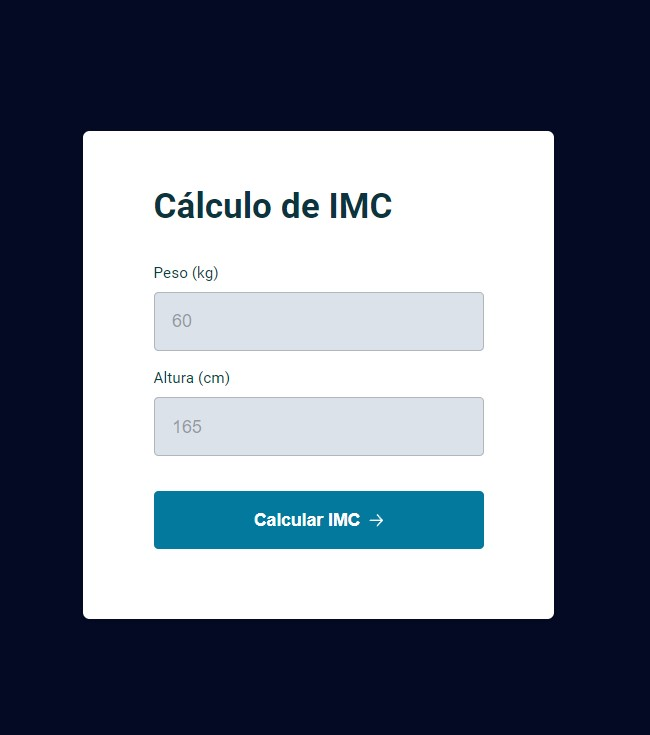
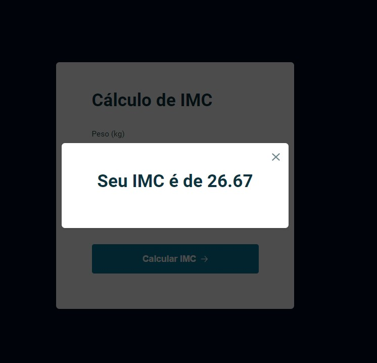
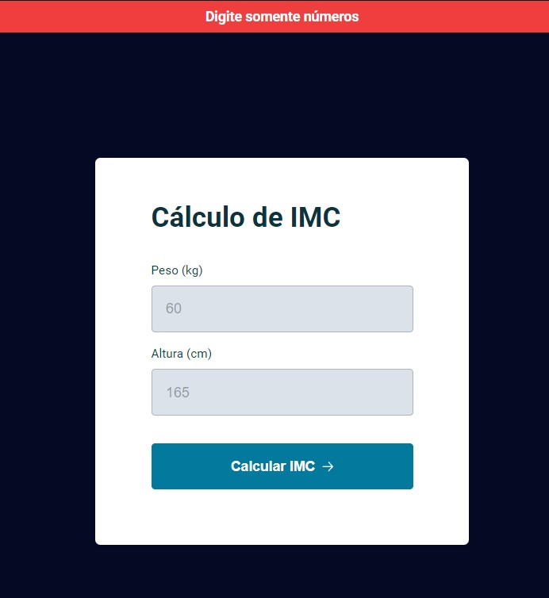

*<h1>Projeto IMC </h1>*

 ↪️ Neste desafio foi criado uma ferramenta para calcular o IMC do usuário, no qual, só aceita o preenchimento com números, como sugerido no placeholder.

↪️ Ao realizar o preenchimento correto com peso e altura, irá surgir a resposta do seu IMC. Podendo ser fechada a qualquer momento pressionando a tecla "ESC" ou fechando com o mouse no local indicado.

↪️ Caso o peso ou altura sejam preenchidos de forma incorreta (com alguma string), irá surgir uma mensagem de erro, impossibilitando-o de avançar.
 
 Essa mensagem irá sumir, assim que um novo preenchimento iniciar. 

<h2>#Sobre o desafio 💻</h2>

 Foi aplicado no projeto:

- HTML
- CSS
- DOM
- ES6 Modules
- Funções no Javascript
- Tipos de exportações e importações

